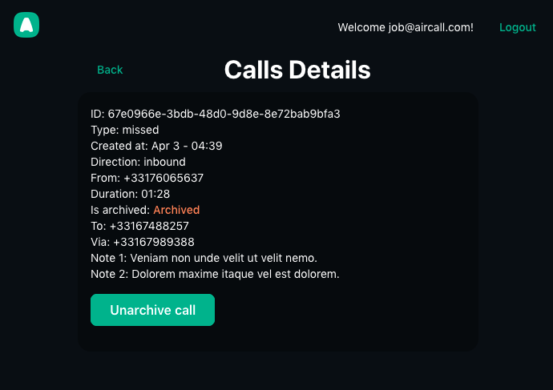

# 👨‍🎨 Assessment results

This pull request is divided into sections, following the tasks by the level of competencies suggested.

1. [Jr. SE contributions](#001)
2. [SE contributions](#002)
3. [Sr. SE contributions](#003)
4. [Staff SE contributions](#004)
5. [Additional improvements added](#005)

<a name="001"></a>
#### Jr. SE contributions

##### Call list page
###### Pagination

1. Import the ```useState``` React hook.
2. Initialize the ```callsPerPage``` variable following the ```useState``` hook convention.
3. Add a handler function to control when the user changes the page size and reflect the change in the UI by setting the value ```callsPerPage``` accordingly.
4. Provide the ```Pagination``` component with the proper props/values/handlers.


```javascript

/**
 * @component > CallsList
 * Extracts of the code implemented
 */

import { useState } from 'react';
// ...
const [callsPerPage, setCallsPerPage] = useState<number>(5);
// ...
const handleOnPageSizeChange = (newPageSize: number): void => {
  setCallsPerPage(newPageSize);
};
// ...
<Pagination
  {...otherProps}
  pageSize={callsPerPage}
  onPageSizeChange={handleOnPageSizeChange}
/>
//...
```

5. Demo


###### Filters

1. Add a filter component to allow filtering the list of calls.
2. The new UI component will consist of a form-like implementation provided with 
(From the design system components):
  - A select ```sort by date``` dropdown.
  - A select ```call types``` dropdown.
  - Link buttons to control either when filters are applied or cleared.

  

3. Add ````handler functions```` to control when the user applies/clears the filters, to emit/executes the callback operation(s) in the parent component.
4. Develop a ````custom hook```` to extract logic from the component. (Filters and maps operations).
4. Persist filters in the browser's address bar, so that we can paginate the list by keeping the filters, as follows:

````javascript
{__DOMAIN__}/calls/?filter=value&anotherFilter=anotherValue
````

5. As the new component is intended to work with the CallsList page strictly, it's a good practice to follow this architectural pattern (Screaming).

```md
├── src/
│   ├── components/
│   │   └── ...
│   └── pages/
│       ├── CallsList/
│       │   ├── components/
│       │   │   └── CallsListFilters.tsx
│       │   ├── hooks/
│       │   │   └── useCallLis.tsx
│       │   └── types/
│       │   │   └── CallsList.d.ts
│       │   ├── CallsList.tsx
│       └── anotherPage/
│           ├── ...
```

6. Demo


###### Group calls

1. Add a custom hook function to map and group the call entries by date.
2. Import the custom hook function into the CallsList page and map the result set whenever a new response payload is received.

> Noticed the calls are grouped by the day they occurred. **i.e.: Apr 4**


<a name="002"></a>
#### SE contributions

###### Logout feature

1. Include the `logout` function from the `useAuth` custom hook.
2. Add a button to the `ProtectedLayout` component.

```javascript
/**
 * @file
 * ProtectedLayout.tsx
 */
// ...
import { useAuth } from '../../hooks/useAuth';
// ...
const { logout } = useAuth();
// ...
<Button name="btn-logout" mode="link" onClick={logout}>
  Logout
</Button>
// ...
```

###### Expiration token UX

1. Add the `refresh token mutation` to the **gql/mutations** folder.

```javascript
import { gql } from '@apollo/client';
import { USER_FIELDS } from '../fragments/user';

export const REFRESH_TOKEN_V2 = gql`
  ${USER_FIELDS}

  mutation RefreshTokenV2 {
    refreshTokenV2 {
      access_token
      refresh_token
      user {
        ...UserFields
      }
    }
  }
`;
```

2. Add a `checkAuthToken` method to check whether the token is expired or not. On top of this implementation, we will need to add the `refreshAuthToken` method.

- If **access_token** is expired but the **refresh_token** does not, the `refreshAuthToken` will be executed.
- If both, **access_token** and **refresh_token** are expired, then execute the `logout` method. (User will be automatically redirected to the Login page).

```javascript
const checkAuthToken = useCallback(() => {
  console.log('checkAuthToken triggered');
  const isAuthTokenExpired = isExpiredToken(localStorage.getItem(AUTH_CONFIG.AUTH_TOKEN_KEY)!);
  const isRefreshTokenExpired = isExpiredToken(
    localStorage.getItem(AUTH_CONFIG.REFRESH_TOKEN_KEY)!
  );

  const shouldRefreshToken = isAuthTokenExpired && !isRefreshTokenExpired;
  const shouldLogout = isAuthTokenExpired && isRefreshTokenExpired;

  if (shouldRefreshToken) {
    refreshAuthToken();
  } else if (shouldLogout) {
    logout();
  } else {
    return;
  }
}, [logout, refreshAuthToken]);
```

3. Also, add the `isExpiredToken` method.

```javascript
  const isExpiredToken = (token: string): boolean => {
    if (typeof token !== 'string') return true;

    const tokenChunks = token.split('.');
    const [, rawExpiration] = tokenChunks;

    const decodedJWTToken = JSON.parse(window.atob(rawExpiration));
    return Date.now() > decodedJWTToken.exp * 1000;
  };
```

4. Both methods will be appended to the **useAuth.tsx** custom hook which contains the **AuthProvider** definition.
5. Then, we initialize an **interval** who will checks for the validation of the token periodically. (Given the auth token frequency parameter).

```javascript
  useEffect(() => {
    let intervalId: NodeJS.Timer;

    if (isLoggedIn) {
      intervalId = setInterval(checkAuthToken, AUTH_CONFIG.CHECK_AUTH_TOKEN_FREQUENCY);
    }
    return () => {
      clearInterval(intervalId);
    };
  }, [isLoggedIn, checkAuthToken]);
```

###### Unit tests

The tool used to perform unit tests is **Jest**.

Added several unit tests:
- `dates.spec.ts` (Helper functions).
- `useCallList.spec.ts` (Custom utils hook).
- `CallsListFilters.spec.tsx` (Component).

Output after running `yarn test`:


<a name="003"></a>
#### Sr. SE contributions

###### E2E test (Cypress)

The tool selected to perform E2E tests is **Cypress**.

**1. Scripts:**

These scripts were added to the project.

```shell
# Open Cypress config wizard, and its tool to monitor/execute/perform/etc. E2E tests
> yarn cy:open

# Execute only the E2E tests within the terminal window, (Make sure the project is running in parallel).
> yarn cy:run

# Starts the application and executes the E2E tests at the terminal level (In-parallel)
> yarn cy:test

# Starts the application and executes the Cypress tool (In-parallel)
> yarn cy:e2e
```

**2. Environment variables:**

To ease the E2E testing, we can provide the Cypress runner with some variables. We only need to **create a .env.e2e file at the project's root level**, and fill in the variables accordingly.

| Env. variable      | Value                                |
| ------------------ | ------------------------------------ |
| APP_BASE_URL       | `http://localhost:3000` or another   |
| AUTH_TOKEN_KEY     | <YOUR_AUTH_TOKEN_KEY>                |
| REFRESH_TOKEN_KEY  | <YOUR_REFRESH_TOKEN_KEY>             |

Then, we need to load them all using `dotenv`, as follows:

```javascript
/**
 * @file
 * cypress.config.ts
 */

import { defineConfig } from "cypress";
import dotenv from 'dotenv';

const env_e2e = dotenv.config({ path: '.env.e2e' }).parsed; // <--- Load environment variables here

export default defineConfig({
  e2e: {
    setupNodeEvents(on, config) {
      config.env = {
        ...config.env,
        ...env_e2e, // <--- Passing environment variables to the configs here
    };

    return config;
    },
  },
});
```
Finally, we can use the variables within any spec file, as follows:

```javascript
/**
 * @file
 * WhateverTest.cy.ts
 */

describe('Whatever test spec', () => {
  it('Whatever test', () => {
    const appBaseURL = Cypress.env('APP_BASE_URL') // <--- Example on how to use an environment variable (i.e.: At test level).
    // ...
  });
});
```

**3. Fixtures**

We can use these files to set dummy data across our tests.

```javascript
/**
 * @file
 * <rootDir>/cypress/fixtures/examples.json
 * 1. Defining our dummy data...
 */

{
  "login": {
    "username": "hello@cypress.io",
    "password": "12345"
  }
}

/**
 * @file
 * Whatever.cy.ts
 * 2. Use it in any spec test...
 */

import fixtures from '../fixtures/example.json';
//..
```
**4. Demo**

4.1. `yarn cy:run` command output.


4.2. Cypress E2E tets in action.


###### Archive call feature

1. Add a mutation within the **gql/mutations** folder.

```javascript
import { gql } from '@apollo/client';
import { CALL_FIELDS } from '../fragments/call';

export const ARCHIVE_CALL = gql`
  ${CALL_FIELDS}

  mutation ArchiveCall($id: ID!) {
    archiveCall(id: $id) {
      ...CallFields
    }
  }
`;
```

2. UI changes, add a basic button to perform the archive call mutation within the CallDeatils page.



3. After the mutation is done, the cache for the `GET_CALL_DETAILS` query is updated, to improve the performance and reduce the load on the back-end services.

###### Sync tabs after archiving a call (Real-time support)

1. Firstly, add a new subscription to the **gql/subscriptions** folder.

```javascript
import { gql } from '@apollo/client';
import { CALL_FIELDS } from '../fragments';

export const CALLS_SUBSCRIPTION = gql`
    ${CALL_FIELDS}
    subscription OnUpdatedCall {
        onUpdatedCall {
            ...CallFields
        }
    }
`;
```

2. Create an `Apollo Client` service to handle either query/mutations operations or subscriptions, using the **splitting link strategy** as follows:

- Create a `httpLink`.
- Create a `webSocketLink`.
- Make sure to provide the authorization header.

```javascript
// ...
headers: {
  Authorization: `Bearer ${myToken}`
}
// ...
```

Some extracts of code implemented within the `Apollo Client` definition:

```javascript
/**
 * @file
 * <rootDir>/src/services/apollo/apolloClient.ts
 */

// ...
const splitLink = split(
  ({ query }) => {
  const definition = getMainDefinition(query);
    return (
      definition.kind === 'OperationDefinition' && definition.operation === 'subscription'
    );
  },
  wsLink(tokenKey),
  authLink.concat(httpLink),
);

const client = new ApolloClient({
  link: splitLink,
  cache: new InMemoryCache()
});

return client;
// ...
```

3. Associate the subscription with the `subscribeToMore` method from the `GET_CALL_DETAILS` query (useQuery) in the CallsDetails page at the `useEffect` hook definition, as follows:

```javascript
// ...
const { loading, error, data, subscribeToMore } = useQuery(GET_CALL_DETAILS, {
    variables: {
      id: callId
    }
  });
// ...
useEffect(() => {
  const unsubscribe = subscribeToMore({
    document: CALLS_SUBSCRIPTION,
    updateQuery: (prevData, { subscriptionData }) => {
      if (!subscriptionData.data) return prevData;
      const {
        data: { onUpdatedCall }
      } = subscriptionData;

      return {
        call: onUpdatedCall
      };
    }
  });

  return () => {
    unsubscribe();
  };
}, [subscribeToMore]);
// ...
```

4. Whenever a `subscribeToMore` follow-up method is executed, a change is detected by the `useEffect` hook, so the associated subscription will be triggered (Using the WebSocket implementation done at the split link section).


5. Afterwards, any change made to the application will be reflected across the other browser's tabs opened at the same section.

<a name="004"></a>
#### Staff SE contributions

###### Release plan

> Noticed that depending on the CI/CD pipeline chosen, the deployment process may vary.

**Contributors process (Brief considerations):**

1. Set a well-documented policy to let others know how to be capable of perfoming a deployment to production.
  **- Some considerations (Defining an ideal time-frame):**
    - App traffic (data/resource usage).
    - User concurrence.
    - Peak hours of usage.
    - Others.
      
2. Each developer should be able to perform a deployment to production, either on demand or by leveraging it to any automatic process already stablished.
  **- Some considerations:**
    - PRs should be reviewed and approved by 2~3 contributors, also by the code owners(s) (If applicable).
    - Prior to merge to any productive branch we need to **tag the release**.
    - Keep an **user-readable-friendly Changelog**.
    - Others.
3. Teams should be aware of any deploy to production (Using any communication tool.- automated messages for instance).

**Deployment process (Brief considerations):**

1. Each deployment should include a:
  - Release to any test environment. (QA or similars).
  - Release to any sandbox environment. (Production-like environment).
  - Any other pre-production environment.
  - Others (Test feature flags, A/B testing, etc.).

2. Prior to any deployment, tests should be addressed (Coverage, Linters, Health checks, environment variables, external libraries/dependencies, others.).
3. Automatic rollbacks should be implemented if any failure occurs.
4. Zero-downtime deploys should be implemented.
5. Others.


<a name="005"></a>
#### Additional improvements added
- Add a `Loader` component.
- Add a basic implementation to the `ProtectedRoute` component.
- Add a feature to navigate the `Login page` if a user is not logged in.
- Allow format date function (helper) supporting different format patterns.
- Add a back button to the CallDetails page.
- Add a username to identify the user.
- Add missing types (TypeScript).
- Add some basic styling improvements.
